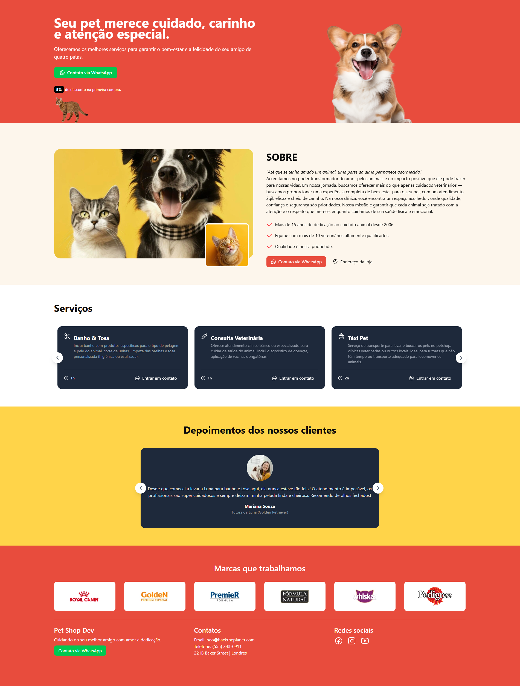

# 🐾 Petshop-Project

Petshop-Project é uma aplicação web moderna e responsiva, desenvolvida como uma landing page para um pet shop. Ela proporciona uma experiência interativa aos usuários, destacando os serviços da clínica através de um design simples e carrosséis interativos. A interface é estilizada com Tailwind CSS, garantindo um visual atraente e altamente personalizável. Desenvolvida com Next.js no front-end e Node.js no back-end, a aplicação proporciona uma navegação rápida e segura.

### 🔗 Acesse o projeto: [Petshop-Project](https://petshop-project-foec.onrender.com/)

---

## 📸 Demonstração



---

## 📋 Funcionalidades

- **Seção de Boas-vindas**: Uma introdução visualmente impactante, destacando o compromisso do pet shop com o cuidado e bem-estar dos animais.
- **Informações sobre a Clínica**: Uma seção com dados sobre a missão, equipe e localização.
- **Exibição de Serviços**: Um carrossel interativo e dinâmico que apresenta os serviços principais, como banho e tosa, consultas veterinárias e hospedagem, com links diretos para mais informações e contato.
- **Depoimentos**: Uma área com feedbacks de clientes, apresentando suas experiências com os serviços do pet shop.
- **Rodapé informativo**: Contatos diretos, links para redes sociais e a apresentação das principais marcas parceiras de produtos pet, proporcionando facilidade no acesso às informações essenciais.

---

## 🛠️ Tecnologias Utilizadas  

**Front-end:**  
  
  
  
  
  

**Back-end:**  


---

## 📁 Estrutura do Projeto
```
Petshop-Project/
├── public  
└── src  
    └── app  
    │    └── _components  
    │    │    ├── about.tsx  
    │    │    ├── aos-init.tsx  
    │    │    ├── footer.tsx  
    │    │    ├── hero.tsx  
    │    │    ├── services.tsx  
    │    │    └── testimonials.tsx  
    │    ├── layout.tsx  
    │    └── page.tsx  
    └── components  
        └── button.tsx
```
---

## ⚙️ Configuração Local

➊ Clone o repositório:
```
git clone https://github.com/alex518123/Petshop-Project.git
```

➋ Navegue até o diretório do projeto:
```
cd petshop-project
```

➌ Instale as dependências:
```
npm install
```

➍ Crie o arquivo .env.local na raiz do projeto e adicione as seguintes variáveis de ambiente:
```
NEXT_PUBLIC_WHATSAPP_NUMBER=seu-numero-de-whatsapp-aqui
```
⚠️ Substitua seu-numero-de-whatsapp-aqui pelo número de WhatsApp correto, sem espaços ou caracteres especiais.

➎  Inicie o servidor de desenvolvimento:
```
npm run dev
```

➏ Acesse a aplicação em http://localhost:3000.

---

## 🔐 Segurança

Dados sensíveis, como números de WhatsApp e outras credenciais, são armazenados de forma segura em variáveis de ambiente, garantindo que informações privadas não sejam expostas no código.


---

## 🤝 Contribuições

Sinta-se à vontade para abrir issues ou pull requests! Qualquer ajuda é bem-vinda. 😄

---

## 📬 Contato

📧 **E-mail:** alexresende675@gmail.com

🐙 **GitHub:** [alex518123](https://github.com/alex518123)

---

## 📄 Licença

Este projeto está licenciado sob a [MIT License](https://opensource.org/licenses/MIT).

---

Desenvolvido por: Alexander Resende [Dê uma olhada no meu portfólio!]()