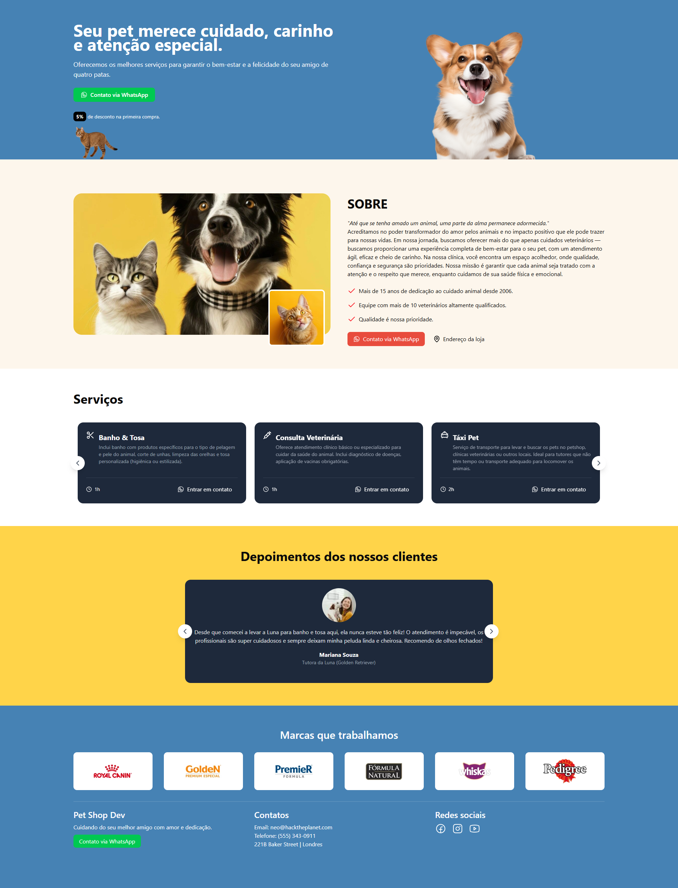

# 🍔 Petshop-Project


### 🔗 Acesse o projeto: [Petshop-Project](https://petshop-project-foec.onrender.com/)

---

## 📸 Demonstração



---

## 📋 Funcionalidades


---

## 🛠️ Tecnologias Utilizadas  


---

## 📁 Estrutura do Projeto
```

```
---

## ⚙️ Configuração Local


---

## 🔐 Segurança

Dados sensíveis como números de WhatsApp são armazenados em variáveis de ambiente.


---

## 🤝 Contribuições

Sinta-se à vontade para abrir issues ou pull requests! Qualquer ajuda é bem-vinda. 😄

---

## 📬 Contato

📧 **E-mail:** alexresende675@gmail.com

🐙 **GitHub:** [alex518123](https://github.com/alex518123)

---

## 📄 Licença

Este projeto está licenciado sob a [MIT License](https://opensource.org/licenses/MIT).

---

Desenvolvido por: Alexander Resende [Dê uma olhada no meu portfólio!]()